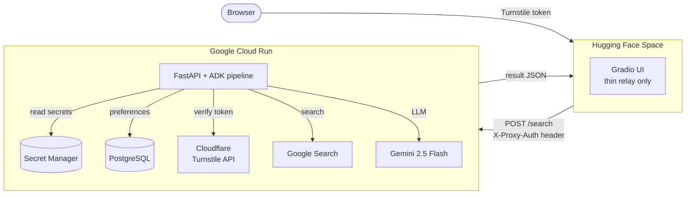
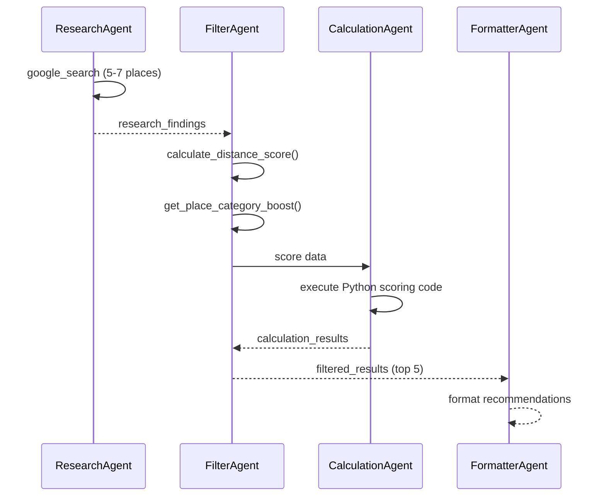
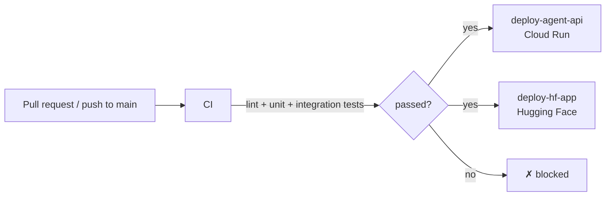

# MapMe Search

[](https://www.a2as.org/certified/agents/xenm/map-me-search?utm_source=github&utm_medium=pull_request)
[](https://github.com/xenm/map-me-search/actions/workflows/ci.yaml)

AI-powered place recommendations using a multi-agent pipeline on Google ADK. You give it a city and your interests; three specialised agents — research, filter, and format — work in sequence to return ranked suggestions.

The engineering challenge worth noting: the source code is fully public, the frontend runs on a third-party platform (Hugging Face), and the backend holds GCP credentials. Building that without any secret ever touching GitHub is the interesting part.

---

## Architecture



### Agent pipeline

Three agents run sequentially. The output key of each is the input context for the next.



---

## Security

The architecture assumes public source code and treats every boundary as untrusted.

| Boundary | Mechanism |
|----------|-----------|
| Browser → HF Space | Cloudflare Turnstile proves the user is human |
| HF Space → Cloud Run | `X-Proxy-Auth` shared secret, constant-time comparison |
| Cloud Run → Cloudflare | Server-side Turnstile verification — token is single-use, time-limited |
| GitHub Actions → GCP | Workload Identity Federation + OIDC — no JSON keys anywhere |
| Cloud Run → Secret Manager | Runtime service account with `secretAccessor` on its own secrets only |

**Key properties:**

- **Zero GCP secrets in GitHub** — deploy job uses OIDC federation; all runtime secrets live in Secret Manager and are injected at deploy time
- **Least-privilege service accounts** — `deploy@` can push images and deploy one service; `run@` can read its own secrets; neither has project-wide roles
- **Immutable container images** — SHA-tagged, Artifact Registry repository has `--immutable-tags` set; once pushed, a tag cannot be overwritten
- **Non-root container** — `Dockerfile` creates and runs as `appuser`
- **Minimal frontend blast radius** — HF Space installs only `gradio`, `httpx`, `python-dotenv`; no GCP SDK, no agent code; a compromised Space cannot reach Google APIs
- **Fail-closed** — missing `PROXY_AUTH_TOKEN` or `TURNSTILE_SECRET_KEY` → HTTP 500, never falls open
- **Deny-by-default workflows** — top-level `permissions: {}` in all workflows; only the deploy job gets `id-token: write`
- **SHA-pinned Actions** — all third-party Actions pinned to commit SHA; Dependabot monitors for updates

---

## Topic Preferences Persistence

All session state is in-memory for the duration of a single request. The only thing written to PostgreSQL is accumulated user preferences per named topic.

- **With topic** → before the LLM call, past preferences for that topic are read from `topic_preferences` and injected into the ResearchAgent prompt as taste context. After a successful response, the new preference is appended as a bullet point. Every 10th update triggers an LLM summarisation pass that compresses the list back to ≤ 8 bullets.
- **Without topic** → fully anonymous; nothing is read from or written to the database.

The table has three columns: `topic` (PK), `preferences` (accumulated bullet points), `version` (integer, incremented per update).

`DATABASE_URL` is **required** — there is no SQLite / in-memory fallback. For local development a `docker-compose.yml` at the repo root brings up a `postgres:16-alpine` container that matches the default `DATABASE_URL` shipped in `agent/.env.example`. If the database is unreachable at request time, the search still returns a response with empty past-preferences context and the failure is logged via `logger.exception`.

> PostgreSQL over TCP automatically gets `ssl=require` injected. Cloud SQL Auth Proxy (Unix socket) is detected by URL pattern and skips SSL — it's already secured at the socket level.

---

## CI/CD



| Workflow | Trigger | What it does |
|----------|---------|--------------|
| `ci.yaml` | PR + push to main | ruff lint, unit tests, integration tests (testcontainers) |
| `deploy-agent-api.yaml` | CI passes on main | build Docker image → push to Artifact Registry → deploy to Cloud Run → smoke test `/health` |
| `deploy-hf-app.yaml` | CI passes on main | push `frontend/` to HF Space via git |

---

## Quick Start

See [docs/QUICKSTART.md](docs/QUICKSTART.md) for full local setup.

```bash
# Agent API
cp agent/.env.example agent/.env   # set GOOGLE_API_KEY
uvicorn agent.agent_api:app --port 8080

# Frontend (second terminal)
cp frontend/.env.example frontend/.env
python frontend/hf_app.py
```

Open `http://localhost:7860`.

---

## Repository Structure

```
├── agent/
│   ├── agent_api.py               # FastAPI app — Cloud Run entry point
│   ├── requirements.txt
│   ├── .env.example
│   └── utils/
│       ├── places_agent_core.py   # Multi-agent pipeline (agents, runner, retry)
│       ├── topic_preferences.py   # topic_preferences table — read/write/summarise
│       └── scoring_tools.py       # Distance / category scoring tools
├── frontend/
│   ├── hf_app.py                  # Gradio relay — HF Space entry point
│   ├── requirements.txt
│   └── .env.example
├── tests/
│   ├── test_api.py                # Security layer unit tests
│   ├── test_integration.py        # Frontend → API integration tests
│   ├── test_persistence.py        # topic_preferences CRUD + summarisation (testcontainers)
│   ├── test_tools.py              # Scoring tool unit tests
│   └── requirements-test.txt
├── docs/
│   ├── QUICKSTART.md
│   └── SECRETS.md                 # Secrets reference for all three platforms
├── .github/
│   └── workflows/
│       ├── ci.yaml
│       ├── deploy-agent-api.yaml
│       └── deploy-hf-app.yaml
├── Dockerfile                     # python:3.14-slim, non-root appuser
└── SECURITY.md
```

---

## Tech Stack

| Layer | Technology |
|-------|-----------|
| AI framework | Google Agent Development Kit (ADK) |
| LLM | Gemini 2.5 Flash + Lite fallback on 503/429 |
| API | FastAPI + Uvicorn |
| Frontend | Gradio |
| Language | Python 3.14 |
| Container | Docker (`python:3.14-slim`, non-root) |
| Preferences DB | PostgreSQL via `asyncpg` (Docker locally, Cloud SQL in prod) |
| CI/CD | GitHub Actions (SHA-pinned, WIF auth) |
| Secrets | Google Secret Manager |
| Registry | Artifact Registry (immutable tags, vulnerability scanning) |
| Bot protection | Cloudflare Turnstile |
| Tests | pytest + testcontainers |

---

## Testing

```bash
# Unit + API security tests (no external services)
python3 -m pytest tests/ -v -k "not integration"

# Full suite including PostgreSQL persistence (requires Docker)
pip install -r tests/requirements-test.txt
python3 -m pytest tests/ -v
```

---

## Secrets Reference

See [docs/SECRETS.md](docs/SECRETS.md) for the full breakdown of what goes where across GitHub, Google Cloud, and Hugging Face.

---

## License

See [LICENSE](LICENSE) file for details.

---

**Built with [Google ADK](https://ai.google.dev/adk), [FastAPI](https://fastapi.tiangolo.com), and [Gradio](https://gradio.app)**
